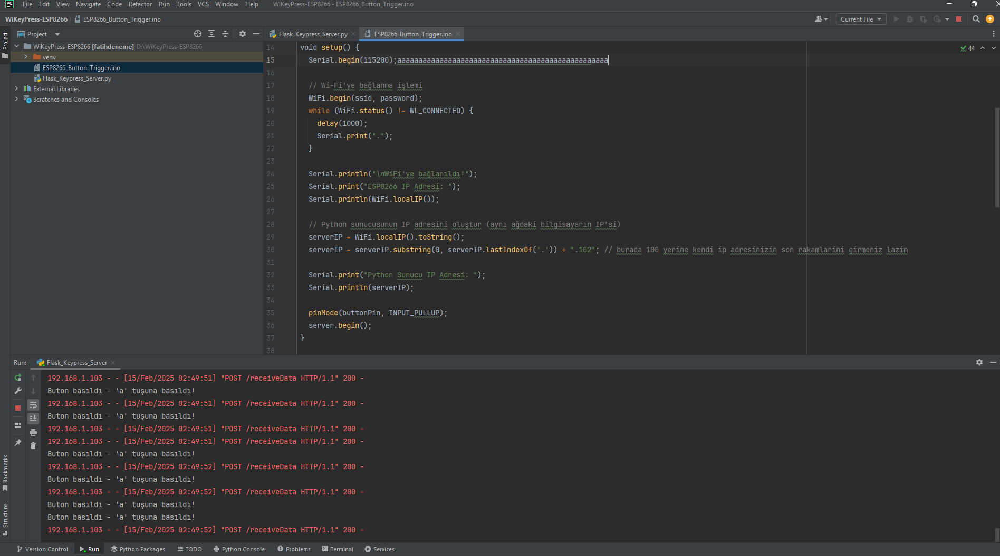

# WiKeyPress-ESP8266

WiKeyPress-ESP8266 allows remote control and interaction by transmitting key data over Wi-Fi. This project is designed to work with the ESP8266 module, providing an easy way to interact with devices via a Wi-Fi network.

## Features:
- Transmit keypress data over Wi-Fi
- Compatible with ESP8266 Wi-Fi module
- Simple and effective remote control setup

## Setup Instructions:

1. **Set up your Wi-Fi credentials:**

   In your code, update the `ssid` and `password` with your network's credentials:

   ```cpp
   const char* ssid = "TurkTelekom_TP36C2_2.4GHz"; // Replace with your Wi-Fi network name
   const char* password = "VtwcWcqwhd7P"; // Replace with your Wi-Fi network password
   ```

2. **Specify the server's IP address:**

   You need to set the correct IP address for the device that will run the server. Specifically, update the last part of the IP address in your code. 

   ```cpp
   + ".102"; // Replace 100 with the last digit(s) of your device's IP address
   ```

   Make sure that this address matches the one assigned to the device on your network.

3. **Connect the ESP8266 to your network:**

   After updating the credentials and IP, upload the code to the ESP8266 and it will attempt to connect to the Wi-Fi network you specified.

## Visual Representation:

When the program runs successfully, it will look something like this:



## Notes:
- Ensure your Wi-Fi network is stable and the ESP8266 is within range.
- If you encounter issues, check your device's IP address settings to make sure they are correct.
